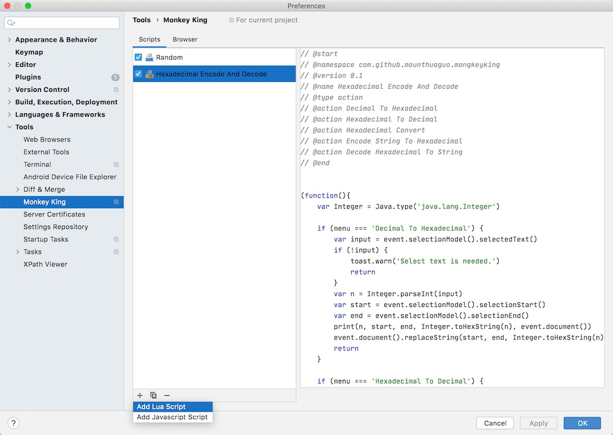
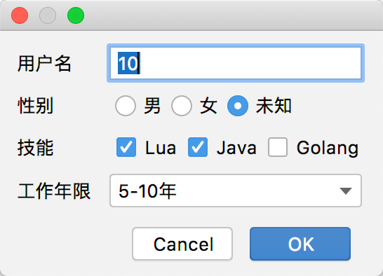
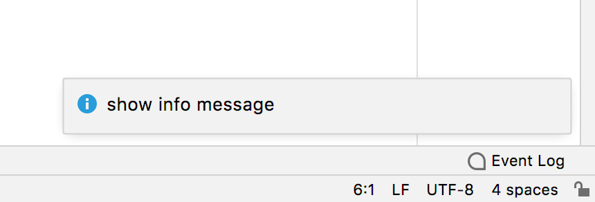
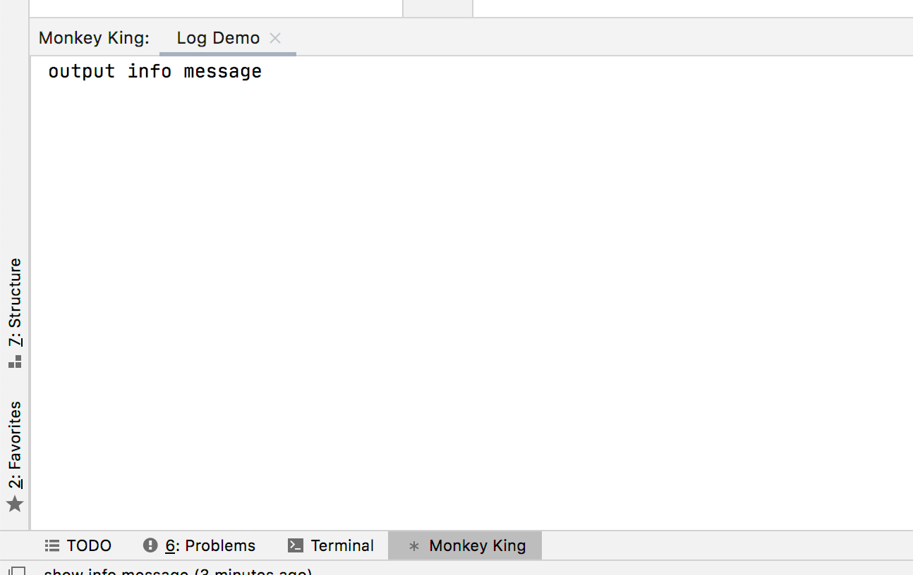
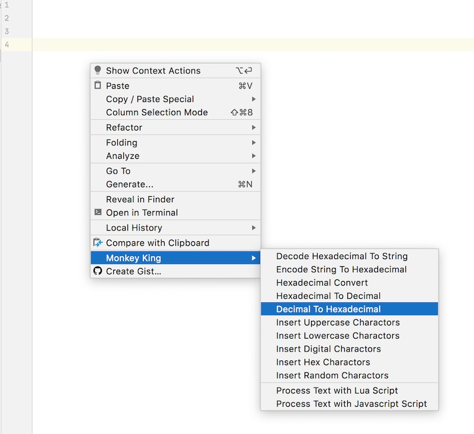
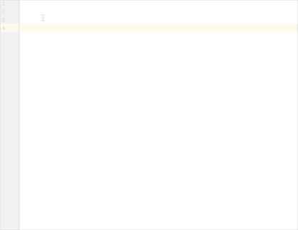

# MonkeyKing


[](https://plugins.jetbrains.com/plugin/PLUGIN_ID)
[](https://plugins.jetbrains.com/plugin/PLUGIN_ID)

## 1. Intro [中文简介](README_ZH.md)

<!-- Plugin description -->
Quickly implement some tiny Intellij Idea scripts by `Javascript` or `Lua` to process text.

Sometimes we want to inject some tiny script to process text, e.g. Base64 encode or decode, AES or RSA encrypt etc. Or
auto generate some text e.g. some random characters, code template. This Idea plugin help to do this.
<!-- Plugin description end -->

## 2. Install

### 2.1 By Intellij Idea Plugin Marketing

In Idea Plugin Marketing page, search MonkeyKing and then click install.

### 2.2 By Zip

Download zip from release page, and open Idea Plugin Manager page. Click *Install Plugin from Disk...*, choose the
download zip.

## 3. Usage

### 3.1 Add a new script

* Click add button at setting page and choose a language



* Use browser

TODO

### 3.2 Specification

#### 3.2.1 Define a Header

1. Header was wrapped by `start` and `end`

```lua
-- @start
-- @version     0.1
-- @namespace   com.github.mounthuaguo.mk
-- @name        Script Name
-- @type        action or template
-- @menu        Name in right click menu
-- @require     https://raw.githubusercontent.com/rxi/json.lua/master/json.lua
-- @ Some other fields what you want。
-- @end

```

2. Header fields

* `version` required.

* `namespace` required.

* `name` required.

* `type` required, Only support `action` and `template` by now. `action` will display in right click menu, `template` is
  predefined template to quick process text.

* `menu` the name in right click menu. Only enable if type is action.

* `require` only support `Lua`, and not support `Javascript` .

* Other fields, `homepage`，`link`, `description` and what every you want to add.

3. Predefined variant and methods

* `menu` the name displayed in right click menu
* `action` a sample wrap of AnActionEvent

```lua

-- in lua script
event.selectionModel.selectedText -- the selected text
event.selectionModel.selectionStart -- the selection start
event.selectionModel.selectionEnd -- the selection end
event.selectionModel.hasSelection -- 

event.document.text -- the text of the document
event.document.textLength -- document length
event.document.lineCount -- document line count
event.document.replaceString(startPosition, endPosition, replace) -- replace a string
event.document.insertString(endPosition, text) -- insert a string

-- in javascript
event.selectionModel().selectedText() -- the selected text
event.selectionModel().selectionStart() -- the selection start
event.selectionModel().selectionEnd() -- the selection end
event.selectionModel().hasSelection() -- 

event.document().text() -- the text of the document
event.document().textLength() -- document length
event.document().lineCount() -- document line count
event.document.replaceString(startPosition, endPosition, replace) -- replace a string
event.document.insertString(endPosition, text) -- insert a string

```

* `dialog` show a dialog

```lua

local result = dialog.show({
    type = 'text', -- text field
    field = '用户名', -- name to display
    default = '10', -- default value, string type
}, {
    type = 'radio', -- radio
    field = '性别', -- name to display
    default = '未知', -- default value, string type
    options = { '男', '女', '未知' } -- options
}, {
    type = 'checkbox', -- radio
    field = '技能', -- name to display
    default = { 'Lua', 'Java' }, -- default value, string array type
    options = { 'Lua', 'Java', 'Golang' } -- options
}, {
    type = 'dropdown', -- dropdown
    field = '工作年限', -- name to display
    default = '0-5年', -- default value, string type
    options = { '0-5年', '5-10年', '10年以上' } -- options
})

if result.success then
    -- result.success is true if user click OK button

    print(result.data['用户名']) -- the text field value
    print(result.data['性别']) -- the radio field value
    print(result.data['技能']) -- the checkbox field value
    print(result.data['工作年限']) -- the dropdown field value

end

```



* `toast` a wrap of notice

```lua
toast.info('show info message')
toast.error('show error message')
toast.warn('show warning message')
```



* `log` a wrap of tool window

```lua
log.info('output info message')
log.error('output error message')
log.warn('output warning message')
```



* `require` help to handle the requirement value.

```lua
-- @start
-- ...
-- @require   https://raw.githubusercontent.com/rxi/json.lua/master/json.lua
-- ...
-- @end

require.a.decode('{}')
-- or
require['a'].decode('{}')
-- a is first require，b is the second，and so on.

```

### 3.3 Use script

* In right click menu



* In search panel



### 4. Q&A

#### 4.1 Why called MonkeyKing？

We can quickly implement a sample script in internet browser by [Tampermonkey](https://www.tampermonkey.net) plugin. The
inspiration for developing this plug-in came from it, so a similar name was given. MonkeyKing is also a character in
Chinese mythology.

#### 4.2 Will other language support be added later?

Currently the plug-ins only support plug-ins written by `Javascript` and `Lua`. As for whether other languages will be
added, it has not yet been determined. If the demand is large, you can consider adding them.

#### 4.3 How to publish a script written by yourself?

All scripts are in [MonkeyKingScripts](https://github.com/Mount-Huaguo/MonkeyKingScripts), you can fork this repository
and submit PR.
