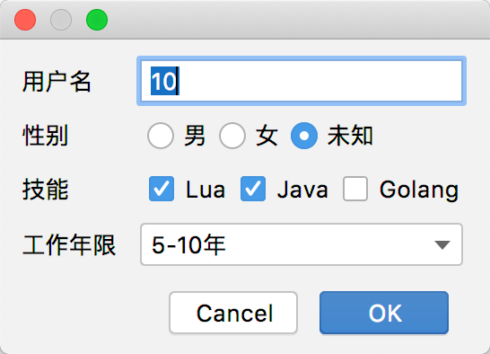
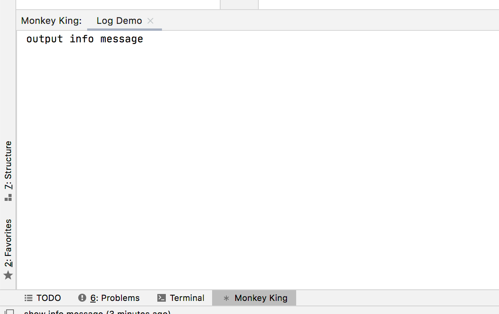
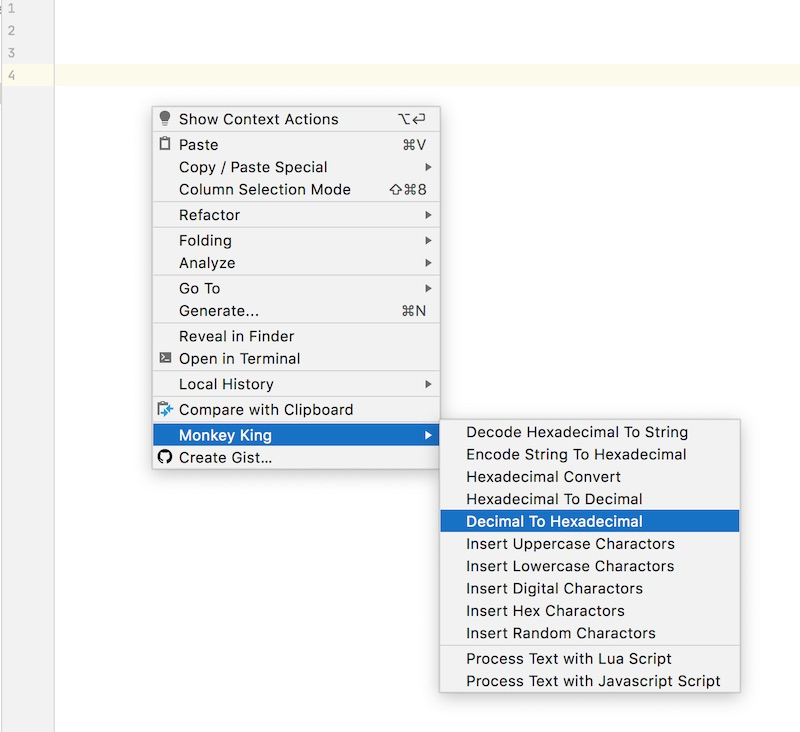

## Monkey King

## 1. 简介

使用`Javascript`或者`Lua`语言快速处理文本的Intellij Idea小插件。

有些时候我们想通过一些小脚本快速将一些文本处理成另一种格式，例如Base64编码，RSA，AES加解密等。 或者自动生成一些文本，比如自动生成一串随机字符串，或者特定格式的代码。 此插件支持用`Javascript`或者`Lua`
实现这样的功能。

## 2. 安装

### 2.1 通过Intellij Idea插件市场安装

在Idea的插件设置界面，搜索MonkeyKing,点击安装即可.

### 2.2 通过源码安装

在 [Release](https://github.com/Mount-Huaguo/MonkeyKing/releases) 界面下载安装包到本地，然后通过在Idea插件设置界面，点击通过本地安装插件，选择刚下载安装包安装。

## 3. 使用

### 3.1 添加一个脚本

* 在设置界面添加点击添加按钮，选择一个实现语言。


* 使用预定义的脚本, 在Browser标签页，点击use按钮


### 3.2 脚本约定

#### 3.2.1 头部定义

1. 头部都定义在`start`和`end`块中

```lua
-- @start
-- @version     0.1
-- @namespace   com.github.mounthuaguo.mk
-- @name        脚本名
-- @type        action or template
-- @menu        右键菜单名
-- @require     https://raw.githubusercontent.com/rxi/json.lua/master/json.lua
-- @一些其他的字段，随便添加。
-- @end

```

2. 预定义的头部字段

* `version` 版本号

* `namespace` 命名空间

* `name` 脚本名

* `type` 脚本类型, 目前只支持 `action` 和 `template` 类型。`action` 会出现在右键菜单中，`template`是快速处理文本时预定义的模板。

* `menu` 右键菜单中显示的名字，只有在

* `require` 引用外部脚本，目前只能使用在`lua`脚本中，`javascript`脚本暂不支持。

* 一些其他的暂时没有用到的字段, `homepage`，`link`, `description`等。

3. 预定义变量及方法

* `menu` 变量，标识选择的右键菜单名
* `action` 变量, 对于AnActionEvent类型的简单包装

```lua

-- in lua
local selectedText = event.selectionModel.selectedText -- 选择的文本
local selectionStart = event.selectionModel.selectionStart -- 选择的文本的开始位置
local selectionEnd = event.selectionModel.selectionEnd -- 选择的文本的末尾位置
local hasSelection = event.selectionModel.hasSelection -- 是否有选择的文本

local text = event.document.text -- 当前文件的文本
local textLength = event.document.textLength -- 当前文件的文本长度
local lineCount = event.document.lineCount -- 当前文件的文本行数
event.document.replaceString(startPosition, endPosition, replace) -- 替换文本
event.document.insertString(endPosition, text) -- 插入文本

-- in js
event.selectionModel().selectedText() -- 选择的文本
event.selectionModel().selectionStart() -- 选择的文本的开始位置
event.selectionModel().selectionEnd() -- 选择的文本的末尾位置
event.selectionModel().hasSelection() -- 是否有选择的文本

event.document().text() -- 当前文件的文本
event.document().textLength() -- 当前文件的文本长度
event.document().lineCount() -- 当前文件的文本行数
event.document().replaceString(startPosition, endPosition, replace) -- 替换文本
event.document().insertString(endPosition, text) -- 插入文本


```

* `dialog` 变量，显示一个对话框，用于接收用户的输入

```lua

local result = dialog.show({
    type = 'text', -- 显示一个文本框
    field = '用户名', -- 展示名
    default = '10', -- 默认文本
}, {
    type = 'radio', -- 单选框
    field = '性别', -- 文本框的名字
    default = '未知', -- 默认选择
    options = { '男', '女', '未知' } -- 选项
}, {
    type = 'checkbox', -- 复选框
    field = '技能', -- 展示名
    default = { 'Lua', 'Java' }, -- 默认选择
    options = { 'Lua', 'Java', 'Golang' } -- 选项
}, {
    type = 'dropdown', -- 下拉列表
    field = '工作年限', -- 展示名
    default = '0-5年', -- 默认选择
    options = { '0-5年', '5-10年', '10年以上' } -- 选项
})

if result.success then
    -- result.success 为true时，标识用户点击了OK按钮

    print(result.data['用户名']) -- 文本框里填写的内容
    print(result.data['性别']) -- 单选框选择的内容
    print(result.data['技能']) -- 复选框选择的内容
    print(result.data['工作年限']) -- 下拉列表选择的内容

end

```



* `toast` 变量，用于展示提示

```lua
toast.info('show info message')
toast.error('show error message')
toast.warn('show warning message')
```


* `log` 变量，用户输出信息

```lua
log.info('output info message')
log.error('output error message')
log.warn('output warning message')
```



* `require` 变量，用于获取头部信息里require里的变量

```lua
-- @start
-- ...
-- @require   https://raw.githubusercontent.com/rxi/json.lua/master/json.lua
-- ...
-- @end

require.a.decode('{}')
-- or
require['a'].decode('{}')
-- a标识第一个require，b标识第二个变量，以此类推

```

* `clipboard` 操作系统剪切板

```lua
-- 复制内容到剪切板
clipboard.setContents('需要复制的内容')

-- 从剪切板中获取内容
local c = clipboard.getContents()

```

* `popup` 提示框 (仅支持javascript脚本)
```js
popup.builder().showBalloon('Hello Popup!')
```


```js
popup.builder().show('<h1>Hello Popup!</h1>') // 支持简单的html标签
```


```js


popup.builder().showSearchEverywhere(
    // searchKey: 表示用户在文本框中输入的内容
    // loadMore: 表示是不是需要加载更多
    // 
    // return: 返回一个结果数组，数组对象需要包含name, desc两个字段
    //         如果是最后一行，并且有更多的数据，需要标记 hasMore 字段。
    function (searchKey, loadMore) {
        return [{
            name: 'options1',
            desc: 'description1'
        },{
            name: 'options2',
            desc: 'description2'
        }]
    }, 
    // 当用户选择一行结果时，调用此函数。
    // index 标识用户点击的所在位置。
    function (index) {
        print('You select: ' + index)
    })

```


### 3.3 使用脚本

* 通过右键菜单中选择需要使用的脚本



* 通过搜索使用脚本


### 4. 问答

#### 4.1 为什么叫MonkeyKing？

浏览器上可以通过[油猴(Tampermonkey)](https://www.tampermonkey.net)
插件快速实现一个自己的插件，开发这个插件的灵感来自油猴插件，所以起了一个类似的名字，MonkeyKing，懂中文的都知道说的是谁。

#### 4.2 后面还会添加其他的语言支持吗？

目前插件只支持`Javascript`和`Lua`编写的插件，至于会不会添加其他语言的支持，还未确定，如果需求量大的话可以考虑添加。

#### 4.3 如何发布自己写的脚本？

所有的脚本都在 [MonkeyKingScripts](https://github.com/Mount-Huaguo/MonkeyKingScripts) 里，可以Fork这个版本库，然后提交PR.

### 5. 参考

1. Lua的解释器使用了[luak](https://github.com/korlibs/luak).
   里面实现了大部分的Lua内置函数，但是并不是所有的函数都支持。一些比较复杂的逻辑可以使用 [luajava](https://github.com/jasonsantos/luajava) 来实现。

2. Javascript使用了Java内置的 [nashorn](https://openjdk.java.net/projects/nashorn/)
   解释器。虽然不支持大部分的前端内置的javascript方法，但是可以和Java进行相互调用，也是非常强大的。
